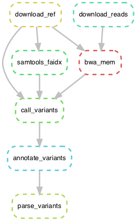
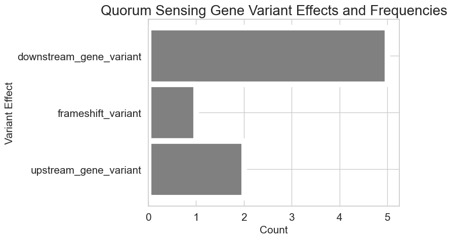

# BIOF501A Term Project: Bacterial Variant Calling and Annotation Pipeline for Quorum Sensing Genes
## By: Janet Li


### Background and Rationale

The purpose of this pipeline is to call and annotate variants in the genome sequence of an AiiA-lactonase treated isolate of *Pseudomonas aeruginosa* strain PAO1 against the reference genome.

*Pseudomonas aeruginosa* is a pathogenic Gram-negative bacterium that causes serious infection in humans. It is often found in the airways of cystic fibrosis patients and is the second most common cause of infections in hospitals. [(Driscoll, Brody & Kollef, 2007)](https://doi.org/10.2165/00003495-200767030-00003). *P. aeruginosa* is also capable of forming biofilms on medical instruments and implants. Antimicrobial resistance is a major public health issue, because infections by resistant bacteria are difficult or even impossible to treat. There are many antimicrobial resistant strains of *P. aeruginosa*, and these mechanisms can arise through a variety biological processes such as modifications to the cell wall or gene regulation through quorum sensing [(Mohanty, Baliyarsignh & Nayak, 2020)](https://doi.org/10.5772/intechopen.88706). Studying the evolution of antimicrobial resistance mechanisms through mutations to genes involved in these biological processes can allow researchers to identify more effective methods of treating *P aeruginosa* infections, as well as new antibacterial targets.

A major aspect of bacterial infection is cell-to-cell communication. Quorum sensing (QS) is the process of multi-cellular gene regulation through the production of signalling molecules. It is used by many bacteria, including *P. aeruginosa*. The production of these signalling molecules increases with cell density, and once cell density reaches a certain threshold, the QS system alters the expression of a subset of genes. QS genes differ between species and strains, but in *P. aeruginosa*, we are interested in the QS genes involved in virulence. Acylated homoserine lactone (AHL) is the most common QS signalling molecule in Gram-negative bacteria [(Venturi, 2006)](https://doi.org/10.1111/j.1574-6976.2005.00012.x). 

AiiA-lactonase is an enzyme that degrades AHL. The isolate (named A1) used in this pipeline was treated with Aiia-lactonase - more information about the experiment can be found [here](https://www.ncbi.nlm.nih.gov//bioproject/667949). The lack of AHL should theoretically reduce the abilities of a bacterial population to communicate among one another, therefore also reducing virulence. A previous study has shown that adding AiiA-lactonase to casein broth cultures impaired the growth of *P aeruginosa* [(Kostylev et al., 2019)](https://doi.org/10.1073/pnas.1819796116). This treatment therefore puts a selective pressure on *P. aeruginosa*, essentially selecting for individuals with mutations that allow them to evade the lack of AHL-mediated growth and/or QS gene regulation. My hypothesis was simple: that there would be at least one mutation in a quorum sensing-related gene in this isolate. I created this pipeline to call, annotate and parse the genomic variants in the AiiA-lactonase treated isolate (treatment) compared to the *Pseudomonas aeruginosa* strain PAO1 reference genome (control), specifically those that are involved in quorum sensing.

By identifying the genomic variants in this isolate and characterizing their biological effects, we can get a better sense of which *Pseudomonas aeruginosa* genes are required for growth and cell-to-cell communication in an AHL deficient environment. This can identify new genes involved in quorum sensing, and possibly point to new antibiotic targets. This type of analysis can also provide some insight into how antimicrobial resistance can develop.

The steps of this pipeline are:
1. Download the reference genome and sequencing reads
2. Index the reference genome with `samtools`
3. Align the reads to the reference genome with `bwa mem`
4. Call and filter low-quality variants with `bcftools`
5. Annotate the variants with `snpEff`, and
6. Parse and plot the variant data with a Python script, `parse_variants.py`

The pipeline is implemented with `Snakemake`.

Here is a visualization of the workflow:



The main package dependencies for this pipeline are:
```bash
python v3.6.6
snakemake v3.13.3
sra-tools v2.8.0
bwa v0.7.17
samtools v1.9
bcftools v1.8
snpEff v5.0
graphviz v2.40.1
```

And the Python-specific dependencies are `pandas` and `seaborn` (which include `numpy` and `matplotlib`). `conda` should be used for package installations and environment setup. Information about installation can be found in the [usage](#usage) section of this README.

---

### Usage

1. Clone this repository, then navigate into the directory to run the pipeline:
```bash
git clone https://github.com/janetxinli/biof501a-term-project.git
cd biof501a-term-project
```

2. Create a `conda` environment with the provided environment file (this will likely only work on a Mac/Unix environment):
```bash
conda env create --file environment.yml
conda activate term_project
```
This will create and activate `conda` environment called `term_project`.

If you're using a different operating system, you most likely won't able to create the environment from the file directly. In that case, check out the [supplementary steps](#supplementary-steps). `conda` environment exports do not translate well across operating systems, and you'll have to set up the environment manually.

3. Run the pipeline with `Snakemake`. You'll need to set the number of cores that `Snakemake` uses with the `--cores` argument.
```bash
snakemake --cores 2
```

I like to use `nohup` so I can run other processes at the same time or log out without stopping the process:
```bash
nohup snakemake --cores 2 &> snakemake.out &
```

This will print all stdout and stderr messages to a file called `snakemake.out`.

4. Compare your outputs with the files in the `expected_outputs` directory. More details about the content and format of the output files can be found in the [outputs](#outputs) section.

#### Supplementary steps

To create and activate a `conda` environment called `term_project` with all of the requirements manually:

```bash
conda env create --name term_project python=3.6
conda activate term_project
```

Some of the other dependencies are not compatible with higher versions of Python, so make sure to specify the version. Next, to install the dependencies:

```bash
conda install -c bioconda snakemake sra-tools bwa samtools=1.9 bcftools snpEff openssl=1.0
conda install -c anaconda graphviz seaborn
```

Your environment is now set up with all of the dependencies required for this pipeline.

---

### Input

The input sequence data are automatically downloaded to a new `data` directory in the first two steps of the pipeline. These inputs include:

|File|Details|Accession|
|---|---|---|
|`GCF_000006765.1_ASM676v1_genomic.fna`|*Pseudomonas aeruginosa* strain PAO1 reference genome sequence|Genbank NC_002516|
|`SRR12820667_1.fastq`|Sequencing reads (read 1) for AiiA-lactonase treated *P. aeruginosa* isolate A1|SRA SRR12820667|
|`SRR12820667_2.fastq`|Sequencing reads (read 2) for AiiA-lactonase treated *P. aeruginosa* isolate A1|SRA SRR12820667|

**Reference Genome**

The reference genome sequence is stored in multi-line FASTA format. The assembly is a single contig (sequence), so the first line is the header:
```
>NC_002516.2 Pseudomonas aeruginosa PAO1, complete genome
```

Followed by several lines containing the assembly sequence.

**Sequencing reads**

The *P. aeruginosa* isolate sequencing reads are paired-end 150 bp Illumina reads. The read pairs are stored in separate FASTQ files which have the following format:
```
@read name
TCCCTGC
+
>>11A11
```

Each read and its corresponding metadata are stored in 4 lines, where the first line begins with `@`, followed by the read header, the second line is the actual DNA sequence of the read, the third line is a placeholder containing a `+` and the read header again (or something nothing), and the fouth contains the quality score for each sequence in the read.

**PAO1 Quorum Sensing Genes**

Another important input is the `PAO1_quorum_sensing_genes.tsv` file in the main directory. This file contains all PAO1 genes with the quorum sensing Gene Ontology annotation (GO:0009372). It is used to determine which variants are located in genes/regions involved in quorum sensing. This was downloaded from the [Pseudomonas database](https://www.pseudomonas.com/strain/show/107).

Each row contains information for a single QS gene. There are several columns containing information about the genes, but the only important columns for this analyses are the Locus Tag, Gene Name and Product Description.

---

### Ouputs

The major outputs of this pipeline are:
- `variants.snpEff.summary.csv`: A comma-separated values (csv) file produced by `snpEff`, containing a broad summary of the variant types, effects and regions identified in the isolate.
- `variants.snpEff.summary.genes.txt`: A plain text, tab-separated values file produced by `snpEff` containing the gene names and loci corresponding to the variants called by `bcftools`.
- `variants.named.snpEff.vcf`: Variants and their annotated effects, produced by `snpEff`.
- `PAO1.AiiA-lactonase.variant_effects.png`: A plot of all variant effects and their frequencies in the *P. aeruginosa* isolate.
- `PAO1.AiiA-lactonase.qs_variants.tsv`: A tab-separated values (tsv) file containing variants in genes with the Quorum sensing Gene Ontology annotation. The columns include the locus ID, gene name, type of variant effect that occurred at that locus, and a description of the gene product.
- `PAO1.AiiA-lactonase.qs_variants.png`: A plot of the QS variant effects and their frequencies.

Examples of these output files can be found in the `expected_outputs` directory.

Other intermediate outputs that aren't included in the directory are:
- `alignments.sorted.bam`: A binary sequence alignment file containing the read alignments to the reference genome. The alignments are sorted by position.
- `variants.named.vcf.gz`: Filtered variants called by `bcftools`, with the reference field renamed to `Chromosome` to match the `snpEff` database name.
- Various index files for the reference genome created by `samtools` and `bwa`, required for some of the steps such as `bcftools call` and `bwa mem`.

After running this pipeline, I was able to identify not one but eight quorum sensing variants in the AiiA-lactonase treated isolate. The majority of the variants were downstream gene variants, which may not necessarily have a functional impact unless there are trans-regulatory factors that act in those regions. Two of the variants were upstream gene variants, which could play a role in gene regulation. A single gene, mexH, had a frameshift variant, which could render its product non-functional. mexH forms a portion of the MexGHI-OpmD efflux pump, which is a type of protein known to contribute to antibiotic resistance in *Pseudomonas aeruginosa* [(Aendekerk, Ghysels, Cornelis & Baysse, 2002)](https://doi.org/10.1099/00221287-148-8-2371).

|locus_id|gene_name|variant_effect|product_description|
|---|---|---|---|
|PA5332|crc|downstream_gene_variant|catabolite repression control protein|
|PA4205|mexG|downstream_gene_variant|hypothetical protein|
|PA5241|ppx|downstream_gene_variant|exopolyphosphatase|
|PA1431|rsaL|downstream_gene_variant|regulatory protein RsaL|
|PA3621.1|rsmZ|downstream_gene_variant|regulatory RNA RsmZ|
|PA4206|mexH|frameshift_variant|probable Resistance-Nodulation-Cell Division (RND) efflux membrane fusion protein precursor|
|PA5241|ppx|upstream_gene_variant|exopolyphosphatase|
|PA1898|qscR|upstream_gene_variant|quorum-sensing control repressor|

